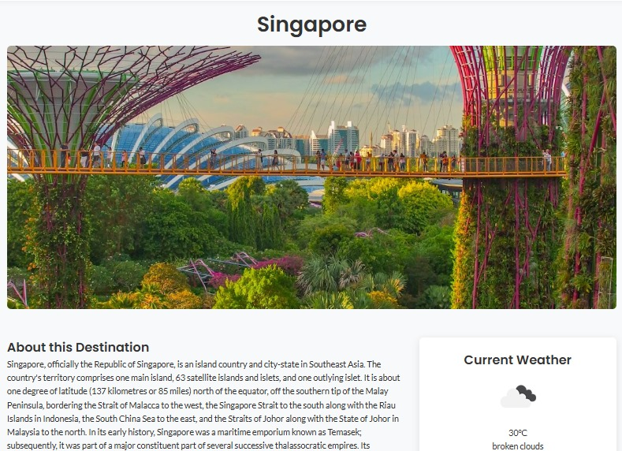
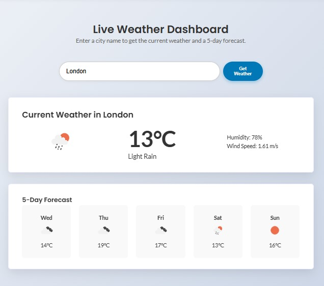

Travel Explorer Website
Live Site: https://a-parn-a.github.io/travel-explorer-website/

A responsive and dynamic travel destination exploration website built with vanilla HTML, CSS, and JavaScript. This project provides a clean, modern interface for users to discover popular destinations, view stunning photography, and check real-time weather information, simplifying the trip planning process.

Features
<ul>
<li>Dynamic Hero Carousel</li>

<li>API-Driven Content</li>

<li>Popular Destinations & Search</li>

<li>Detailed Destination Pages (Description, Gallery, Weather)</li>

<li>Live Weather Dashboard with 5-Day Forecast</li>

<li>Fully Responsive Design with Animated Mobile Navigation</li>
</ul>

Technologies Used
<ul>
<li>Frontend: HTML5, CSS3, JavaScript (ES6+)</li>

<li>APIs: Unsplash, OpenWeatherMap, Wikipedia</li>

<li>Deployment: Git, GitHub, GitHub Pages, GitHub Actions</li>
</ul>

Screenshots

**Homepage**

**Destination Page**

**Weather Dashboard**

Local Setup
To run this project on your local machine:

Clone the repository:

git clone [https://github.com/A-parn-a/travel-explorer-website.git](https://github.com/A-parn-a/travel-explorer-website.git)

Navigate to the project directory:

cd travel-explorer-website

Create your own secrets.js file at assets/js/secrets.js with your API keys.

Open index.html in your browser.
